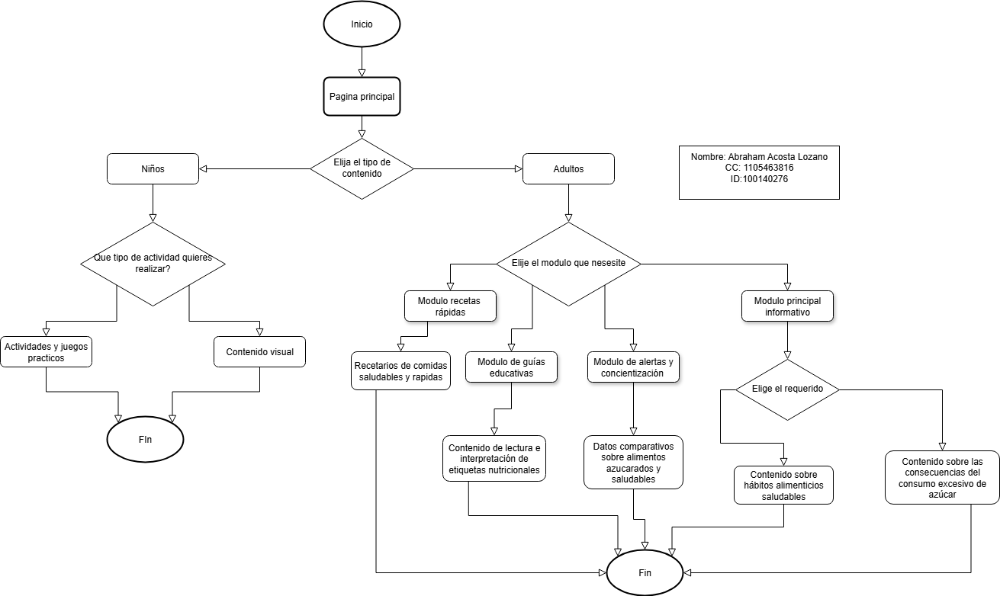

# Diagrama de flujo solucion

El diagrama de flujo de solución original puede ser consultado en el Anexo C.3 del presente documento.

> _Nota. Representación visual del sistema que muestra las interacciones de los usuarios con el núcleo del sistema de información. Fuente: Elaboración propia en Draw.io._