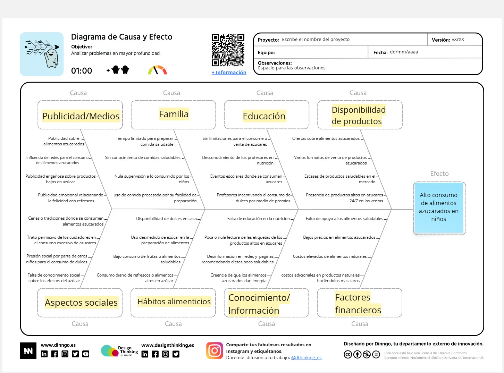

# Diagrama de Ishikawa Fase Definir Desigh Thinking

Por medio del diagrama de causa y efecto logramos desglosar de mejor manera las principales causas que contribuyen a la problemática del alto consumo de azucares en los niños, facilitándonos encontrar las raíces del problema. El mapa de causa y efecto original puede ser consultado en el Anexo B.2 del presente documento.

> _Nota. Resultado de la fase Definir del Design Thinking, donde desglosa las principales causas que contribuyen al alto consumo de azúcares en los niños, facilitando la identificación de las raíces del problema. Fuente: Elaboración propia._