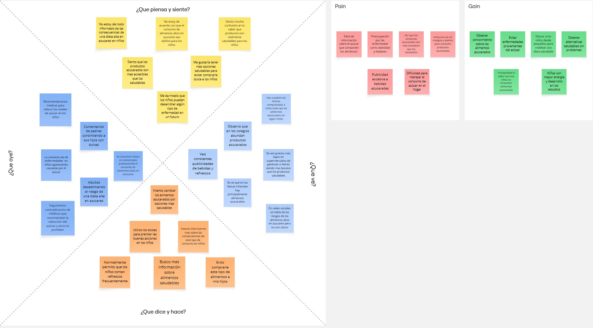

# Mapa de empatia Fase empatizar Desigh Thinking

Se elaboró un mapa de empatía para conocer las opiniones de los cuidadores sobre el consumo de alimentos con alto contenido de azúcar en sus niños, permitiéndonos conocer sus miedos y frustraciones frente a las consecuencias que puede conllevar en la salud infantil este tipo de hábitos, junto a sus motivaciones y deseos para adoptar un estilo alimenticio más saludable.
El mapa de empatía original puede ser consultado en el Anexo B.1 del presente documento.

> _Nota. Nota. Herramienta visual de la Fase Empatizar del Design Thinking, sintetiza lo que los Padres/Acudientes sienten, piensan, dicen y hacen frente al consumo de azúcar en sus hijos. Fuente: Elaboración propia._