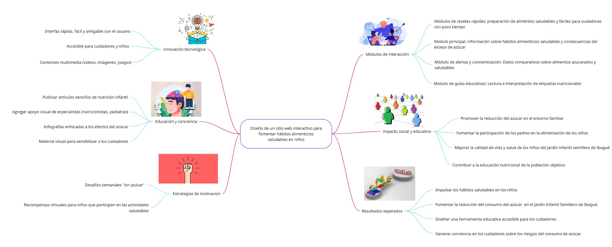

# Mapa mental Fase idear  Desigh Thinking

Elaborando el mapa mental, podemos organizar las principales ideas y soluciones a la problemática planteada, además de ofrecer respuestas a las causas antes mencionadas, para implementar en el proyecto del diseño de la página. El mapa mental original puede ser consultado en el Anexo B.3 del presente documento.

> _Nota. Resultado de la fase Idear del Design Thinking, donde organiza las principales ideas y soluciones a la problemática, proponiendo los módulos claves del sitio web para implementarse en el diseño. Fuente: Elaboración propia._