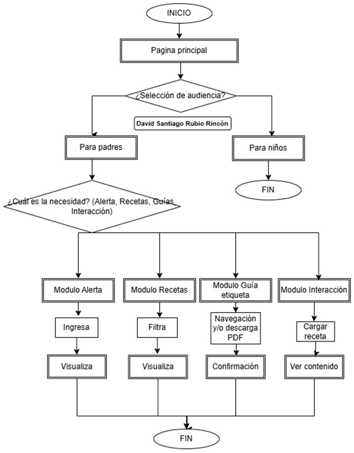
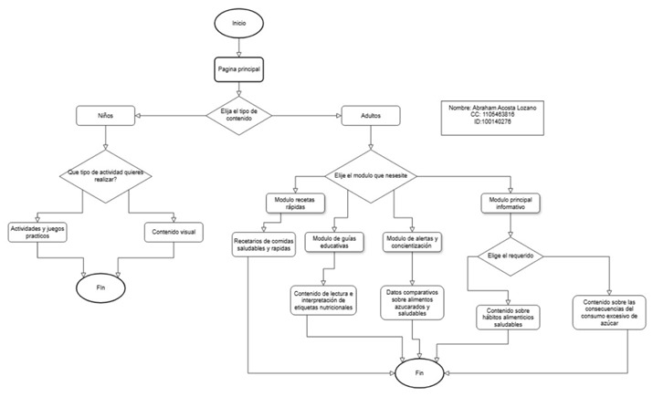

## Matriz de riesgo

## Diagrama de flujo de solución
### Diagrama de flujo de solución – David Santiago Rubio Rincón

El diagrama de flujo de solución original puede ser consultado en el Anexo C.1 del presente documento.

>_Nota. Representación visual del sistema que muestra las interacciones de los usuarios con el núcleo del sistema de información. Fuente: Elaboración propia en Draw.io.

## Diagrama de flujo de solución – Ganador
El diagrama de flujo de solución original puede ser consultado en el Anexo C.4 del presente documento.

>_Nota. Representación visual del sistema que muestra las interacciones de los usuarios con el núcleo del sistema de información. Fuente: Elaboración propia en Draw.io.