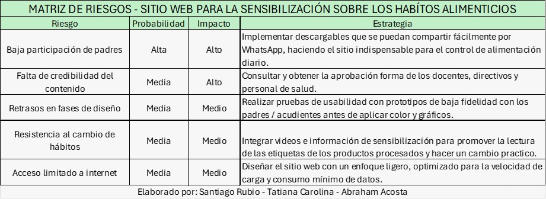

## Matriz de riesgo

Evaluación de los posibles riesgos críticos del proyecto, clasificándolos según su impacto y probabilidad para definir una estrategia de mitigación

>_Nota. Evaluación de los posibles riesgos críticos del proyecto, clasificándolos según su impacto y probabilidad para definir una estrategia de mitigación. Fuente: Elaboración propia.