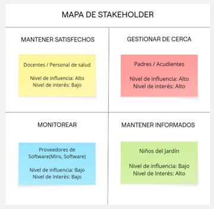

## Stakeholders

El mapa de StakeHolders es una herramienta fundamental que nos permite clasificar a las partes interesadas según su capacidad de influir en el proyecto. El mapa de Stakeholders original puede ser consultado en el Anexo B.4 del presente documento.

>_Nota. Herramienta de análisis que clasifica a los actores clave del Jardín Infantil Semillero según su nivel de influencia e interés sobre el proyecto. Fuente: Elaboración propia con la herramienta digital Miro.