# Resultados de la encuesta
El resultado de información se realizó mediante la aplicación de una encuesta digital cuantitativa a 20 acudientes del Jardín Infantil Semillero de Ibagué. El cuestionario original puede ser consultado en el Anexo A del presente documento.

## 1. Con que frecuencia el niño consume bebidas azucaradas (Gaseosas, refrescos, jugos en la caja, bebidas energéticas, ¿bebidas deportivas con endulzantes)?
Obtuvimos que:
• 45% (9 de 20) de los acudientes responde” Frecuentemente” o “A veces”.

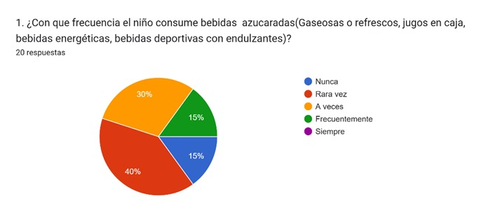
>_Nota. Primera pregunta de la encuesta aplicada a 20 acudientes, donde el 45% reporta consumo frecuente o a veces. Fuente: Elaboración propia a partir de datos de Google Forms.

**Interpretación:** Este alto porcentaje de consumo frecuente determina que las bebidas azucaradas forman parte de un hábito apropiado tanto por los cuidadores como los niños. El diseño debe incluir información para sustituir las bebidas azucaradas por alternativas más sanas.

## 2. ¿Con que frecuencia consume frutas o verdura el niño?
Obtuvimos que:
• 80% (16 de 20) de los acudientes respondieron “Siempre” o “Frecuentemente”.

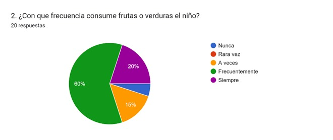
>_Nota. Segunda pregunta de la encuesta aplicada a 20 acudientes, donde el 80% reporta el consumo frecuente de frutas por parte de sus hijos. Fuente: Elaboración propia a partir de datos de Google Forms.

**Interpretación:** Este gran índice denota que los padres tienen la voluntad de añadir alimentos sanos en los platos de los niños. Podemos deducir que el problema está en el exceso de azucares en la alimentación infantil.

## 3. ¿Con que frecuencia suele comer el niño alimentos azucarados (chocolates, pasteles, postres, galletas)?
Obtuvimos que:
• 65% (13 de 20) de los padres respondieron “Casi siempre” o “A veces”.

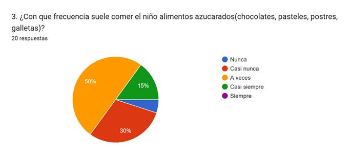
>_Nota. Tercera pregunta de la encuesta aplicada a 20 acudientes, donde el 65% reporta que el niño con frecuencia solo consumir alimentos azucarados. Fuente: Elaboración propia a partir de datos de Google Forms.

**Interpretación:** Este porcentaje confirma que el azúcar en un consumo constante en diferentes presentaciones (bebidas y alimentos). El sitio web debe educar y compartir información sobre el control y la frecuencia máxima de consumo.

## 4. Cuantas veces a la semana el niño consumo comidas rápidas (pizza, hamburguesa, ¿perro caliente)?
Obtuvimos que:
• 80% (16 de 20) de los acudientes reporta que el niño consume comidas rápidas de “1 vez a la semana” o “1-2 veces por semana”.

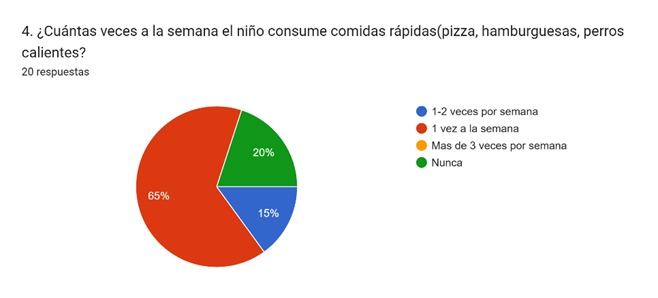
>_Nota. Cuarta pregunta de la encuesta aplicada a 20 acudientes, donde el 80% reporta que el niño consume comidas rápidas entre 1 a 2 veces por semana. Fuente: Elaboración propia a partir de datos de Google Forms.

**Interpretación:** La alta frecuencia que tiene el niño de consumo de comidas rápidas se puede asociar al corto tiempo de preparación que conllevan estos alimentos. El diseño debe incluir un módulo de recetas saludables y rápidas para ofrecerle mejores opciones a niños y padres.

## 5. ¿Qué tipo de bebidas consume el niño con mayor frecuencia?
Obtuvimos que:
• 85% (17 de 20) de los padres responde “Agua” o “Jugos naturales” con mayor frecuencia.

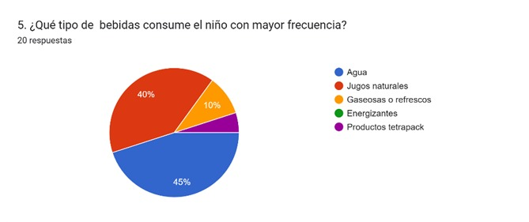
>_Nota. Quinta pregunta de la encuesta aplicada a 20 acudientes, donde el 85% reporta que el niño consume agua o jugos naturales con mayor frecuencia. Fuente: Elaboración propia a partir de datos de Google Forms.

**Interpretación:** Las bebidas saludables coexisten con las bebidas con exceso de azúcar. La solución debe reforzar la prioridad de las bebidas sanas y proponer ideas creativas para su consumo.

## 6. ¿Considera que el consumo de azúcar del niño/a es alto?
Obtuvimos que:
• 70% (14 de 20) de los padres respondió “No” (45%) o “No estoy seguro” (25%).

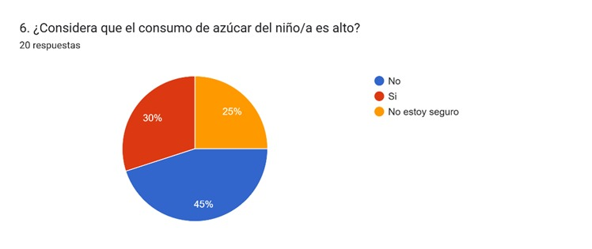
>_Nota. Sexta pregunta de la encuesta aplicada a 20 acudientes, donde el 70% de los padres no considera que el consumo de azúcar del niño no es alto. Fuente: Elaboración propia a partir de datos de Google Forms.

**Interpretación:** La gran mayoría de los padres (7 de cada 10) desconoce y no presta importancia a la magnitud del riesgo, a pesar del alto consumo que pudieron manifestar en preguntas anteriores de la encuesta. El diseño debe tener un módulo de alerta visual para transformar esta percepción subjetiva en datos objetivos.

## 7. ¿Cree que el consumo de azúcar del niño puede afectar su salud?
Obtuvimos que:
• 20% (4 de 20) de los padres responde “No” o “No estoy seguro”.

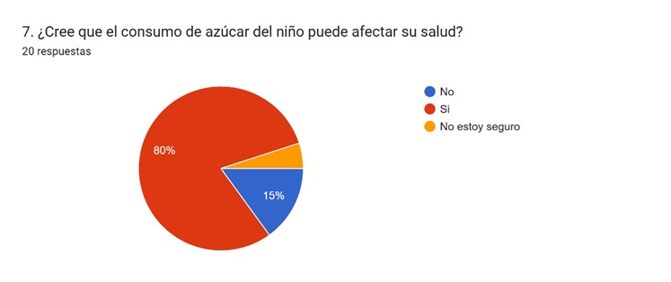
>_Nota. Séptima pregunta de la encuesta aplicada a 20 acudientes, donde el 20% de los padres no considera que el consumo de azúcar del niño no pueda afectar su salud. Fuente: Elaboración propia a partir de datos de Google Forms.

**Interpretación:** Aunque la mayoría de los encuestado considero que el azúcar puede afectar a la salud del niño, la minoría del 20% de los encuestado consideran que no es un riesgo. El diseño debe incluir contenido educativo para reforzar la conciencia y reducir significativamente la incertidumbre e ignorancia frente al tema.

## 8. ¿Tiene alguna fuente de información sobre los alimentos que consume el niño?
Obtuvimos que:
• 30% (6 de 20) de los padres responde “No”.

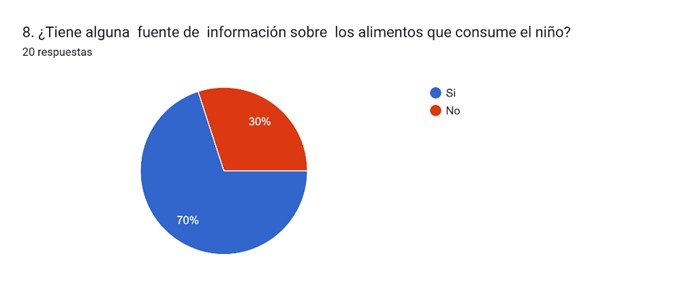
>_Nota. Octava pregunta de la encuesta aplicada a 20 acudientes, donde el 30% de los padres no tiene alguna fuente de información sobre los alimentos que consume el niño. Fuente: Elaboración propia a partir de datos de Google Forms.

**Interpretación:** La existencia de fuentes de información no es equivalente a que todos los padres lean sobre los alimentos que están consumiendo sus niños.

## 9. ¿Revisa las etiquetas de los productos que consume el niño?
Obtuvimos:
• 45% (9 de 20) de los acudientes son inconsistentes al revisar las etiquetas, respondiendo “A veces” (35%), “Casi nunca” (5%) o “Nunca” (5%).

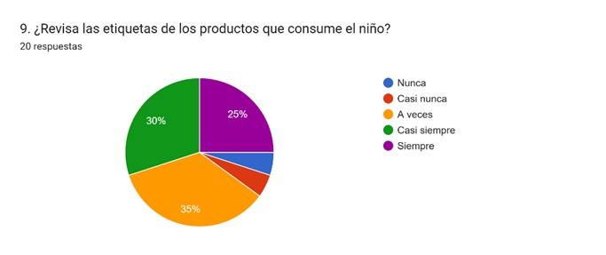
>_Nota. Novena pregunta de la encuesta aplicada a 20 acudientes, donde el 45% de los padres son inconsistentes al revisar las etiquetas de los productos. Fuente: Elaboración propia a partir de datos de Google Forms.

**Interpretación:** La falta de conocimiento acerca de las etiquetas de los productos que consume el niño resalta una pieza clave por la cual se genera esta problemática. El diseño debe incluir guías visuales sencillas sobre lectura de etiquetas y explicando que generan ciertos compuestos químicos en la salud de los niños.

## 10. ¿Conoce alguna página con información enfocada a las conductas alimenticias de los niños?
Obtuvimos que:
• 70% (14 de 20) de los acudientes responde “No”.

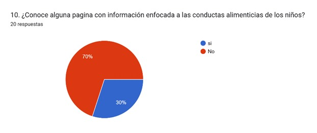
>_Nota. Decima pregunta de la encuesta aplicada a 20 acudientes, donde el 70% de los padres no conoce alguna página de información enfocada a las conductas alimenticias de los niños. Fuente: Elaboración propia a partir de datos de Google Forms.

**Interpretación:** Este dato corrobora que la solución tecnológica propuesta será nueva en esta población. El diseño del sitio web cubrirá una necesidad.

## 11. ¿Le gustaría obtener información sobre las conductas alimenticias saludables para los niños y el impacto que tienen estos alimentos?
Obtuvimos que:
• 90% (18 de 20) de los acudientes responde “Si”.

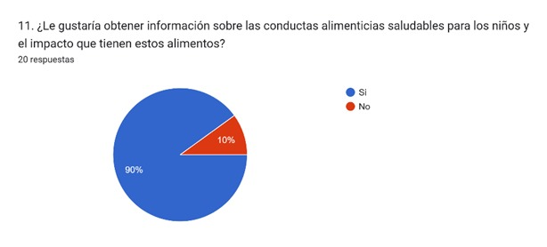
>_Nota. Onceava pregunta de la encuesta aplicada a 20 acudientes, donde el 90% de los padres les gustaría obtener sobre las conductas alimenticias saludables para los niños. Fuente: Elaboración propia a partir de datos de Google Forms.

**Interpretación:** Confirma la disposición de los encuestados en la adopción de una solución.

# Conclusión levantamiento de información
El proceso de levantamiento de información mediante la encuesta digital dirigida a 20 padres o acudientes del Jardín Semillero de la ciudad de Ibagué valida la hipótesis central del proyecto. El análisis de los datos cuantitativos determina la viabilidad de la solución tecnológica planteada.
La solución tecnológica debe ser diseñada como un sistema de apoyo a la toma de decisiones con el propósito de transformar hábitos, vidas y lograr que se tome más conciencia frente a este asunto; con refuerzo de un módulo de alertas y riesgos, recetas rápidas, guías e información necesaria para garantizar la viabilidad y éxito del proyecto.