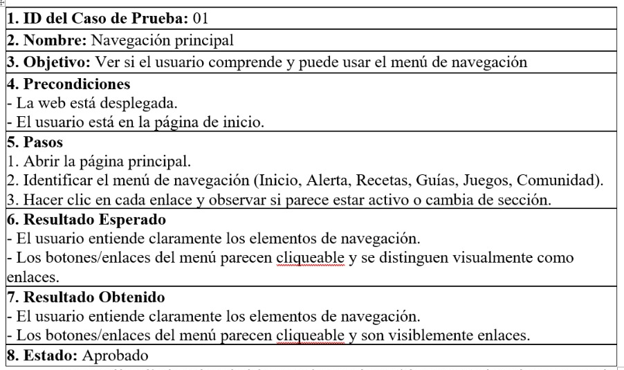
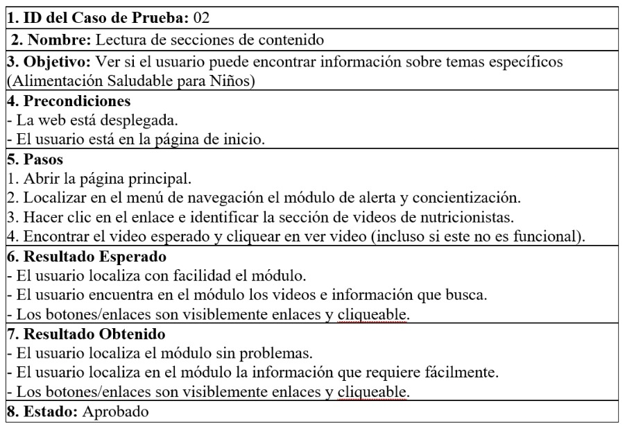
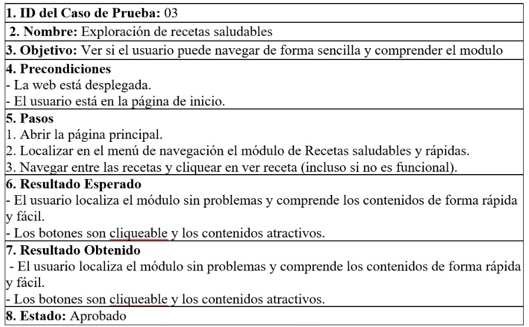
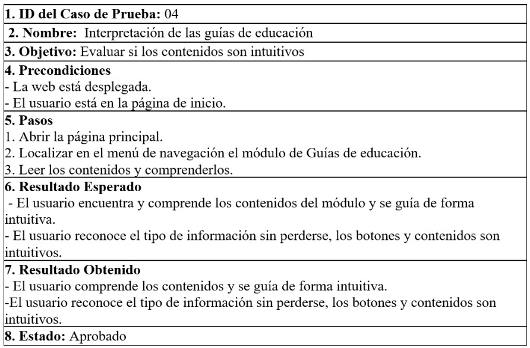
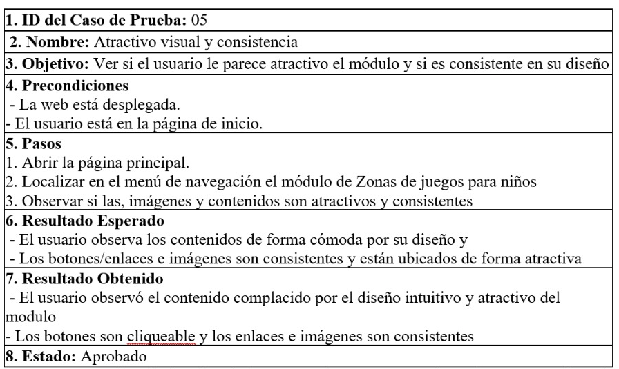
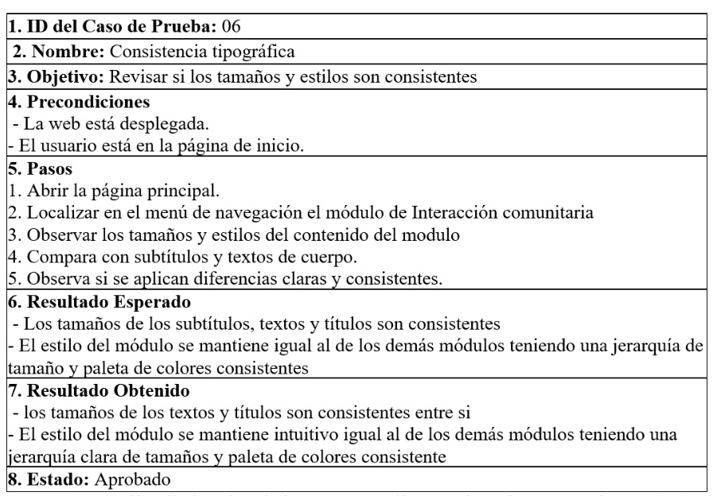

## Casos de prueba

Los casos de prueba evaluados se enfocan en analizar la experiencia de usuario en el sitio web “Alimentación Saludable Infantil”, verificando su facilidad de navegación, compresión de los contenidos, además de la interacción del usuario con los distintos módulos del sistema, principalmente evaluando aspectos como el uso del menú principal, la exploración de recetas saludables, la interpretación de guías y la consistencia visual y tipográfica del diseño.

Tabla 15- Tabla caso de prueba 01

>_Nota. La tabla evalúa el caso de prueba de la navegación principal en menú de inicio para probar si el usuario comprende perfectamente el menú de navegación. Fuente: Elaboración propia. 

Tabla 16 - Tabla caso de prueba 02

>_Nota. La tabla evalúa el caso de prueba de lectura de secciones de contenido para probar si el usuario puede encontrar información específica en la web. Fuente: Elaboración propia. 

Tabla 17 - Tabla caso de prueba 03

>_Nota. La tabla evalúa el caso de prueba de exploración de recetas saludables para probar si el usuario puede navegar y comprender el módulo. Fuente: Elaboración propia.

Tabla 18 - Tabla caso de prueba 04

>_Nota. La tabla evalúa el caso de prueba de interpretación de las guías de educación para probar que los contenidos de la web son intuitivos. Fuente: Elaboración propia.

Tabla 19 - Tabla caso de prueba 05

>_Nota. La tabla evalúa el caso de prueba de atractivo visual y consistencia para probar que el usuario se ve atraído por el módulo y su diseño. Fuente: Elaboración propia.

Tabla 20 - Tabla caso de prueba 06

>_Nota. La tabla evalúa el caso de prueba de consistencia tipográfica para probar que los tamaños y estilos son consistentes. Fuente: Elaboración propia.

