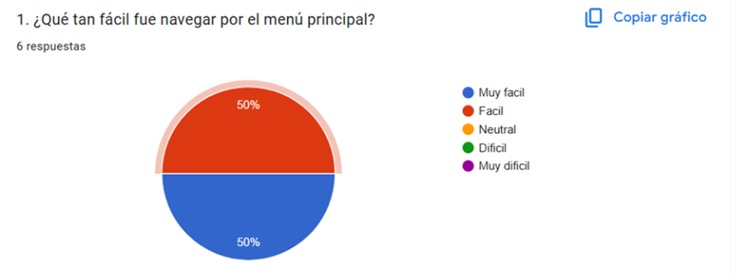
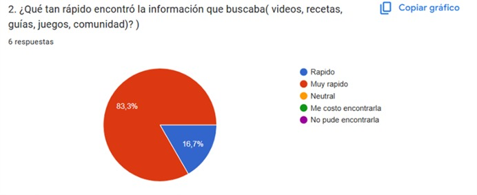
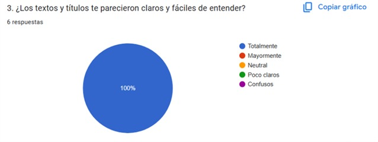
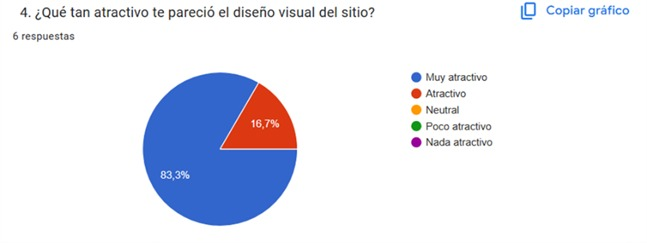
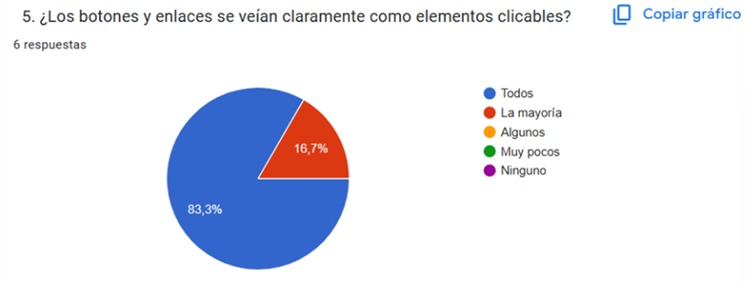
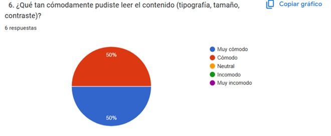

## Documentación de Pruebas de Usabilidad
Nombre del Proyecto: Alimentación saludable para niños 
Versión del desarrollo: 1.0.1
Fecha de la prueba:13 de diciembre de 2025
## Equipo responsable:
- David Santiago Rubio Rincón
- Tatiana Carolina Rubio Rincón
- Abraham Acosta Lozano 
Herramienta utilizada: Google Forms 
## Objetivos de la Prueba: 
Evaluar la compresión del contenido, el atractivo del diseño y la facilidad de navegación que tiene la página web.
## Número de Participantes: 
6 participantes respondieron la prueba de usabilidad.

## Tareas/Escenarios/Resultados Cuantitativos
1. ¿Qué tan fácil fue navegar por el menú principal?

Ilustración 34 - Figura estadística 1

>_Nota. Figura estadística del menú de navegación. Fuente: elaboración propia.

Tiempo promedio estimado: 118.4 segundos. 
Tasa de éxito: 100% 
Tasa de error: 0% 
Observaciones e Insights: 50% de los usuarios percibió la navegación como algo fácil y el otro 50% como algo muy fácil, por lo que el 100% de los usuarios logro completar la tarea con simpleza, evidenciando la intuitiva navegación del menú principal. 

2. ¿Qué tan rápido encontró la información que buscaba (videos, recetas, guías, juegos, comunidad)?

Ilustración 35 - Figura estadística 2

>_Nota. Figura estadística de la velocidad de búsqueda de información. Fuente: elaboración propia 

Tiempo promedio estimado: 121.6 
Tasa de éxito: 100% 
Tasa de error: 0% 
Observaciones e Insights: 83,3% de los usuarios encontró muy rápido la información que buscaba y el otro 16,7% de forma rápida, por lo que se evidencia que la página web tiene gran facilidad entre el acceso a sus contenidos. 

3. ¿Los textos y títulos te parecieron claros y fáciles de entender? 

Ilustración 36 - Figura estadística 3

>_Nota. Figura estadística de compresión de textos y títulos. Fuente: elaboración propia

Tiempo promedio estimado: En esta pregunta no hay tiempo estimado por que es sobre el diseño del sitio web 
Tasa de éxito: 100% 
Tasa de error: 0% 
Observaciones e Insights: El 100% de los usuarios afirma que los textos y títulos son fáciles de entender por lo que la taza de éxito para las opiniones positivas es del 100%, evidenciando el diseño de fácil compresión de los textos y títulos del sitio web. 

4. ¿Qué tan atractivo te pareció el diseño visual del sitio?

Ilustración 37 - Figura estadística 4

>_Nota. Figura estadística de atractivo visual. Fuente: elaboración propia

Tiempo promedio estimado: En esta pregunta no hay tiempo estimado por que es sobre el diseño del sitio web 
Tasa de éxito: 100% 
Tasa de error: 0% 
Observaciones e Insights: Al 83,3% de los usuarios les pareció muy atractivo el diseño visual del sitio y atractivo al 16,7, por lo que la taza de éxito de opiniones positivas es del 100%, evidenciando que la página web posee un diseño visual muy atractivo. 

5. ¿Los botones y enlaces se veían claramente como elementos cliqueables?

Ilustración 38 - Figura estadística 5

>_Nota. Figura estadística de claridad en elementos cliqueables. Fuente: elaboración propia

Tiempo promedio estimado: En esta pregunta no hay tiempo estimado por que es sobre el diseño del sitio web 
Tasa de éxito: 83,3% 
Tasa de error: 16,7% 
Observaciones e Insights: El 83,3% de los usuarios dicen que todos los cables son elementos cliqueables y el 16,7 dice que solo la mayoría, teniendo una taza de éxito de opiniones positivas del 83,3% y una taza de error de opiniones negativas del 16,7%, por lo que la página web aún debe resaltar algunos de los elementos cliqueables.

6. ¿Qué tan cómodamente pudiste leer el contenido (tipografía, tamaño, contraste)?

Ilustración 39 - Figura estadística 6

>_Nota. Figura estadística de comodidad de lectura en el contenido. Fuente: elaboración propia

Tiempo promedio estimado: En esta pregunta no hay tiempo estimado por que es sobre el diseño del sitio web 
Tasa de éxito: 100% 
Tasa de error: 0% 
Observaciones e Insights: El 50% de los usuarios dicen que la lectura del contenido es muy cómoda y el otro 50% cómoda, teniendo una taza de éxito de opiniones positivas del 100%, evidenciando que la tipográfica, tamaño y contrastes de la página son adecuados.

7. ¿Recomendarías este sitio a otra persona interesada en la salud infantil?

Ilustración 40 - Figura estadística 7

>_Nota. Figura estadística de recomendación a personas interesadas. Fuente: elaboración propia

Tiempo promedio estimado: En esta pregunta no hay tiempo estimado por que es sobre el diseño del sitio web 
Tasa de éxito: 100% 
Tasa de error: 0% 
Observaciones e Insights: El 100% de los usuarios dicen que, si recomendaría la página teniendo una tasa de éxito de opiniones positivas del 100%, dejando en claro que la página web es adecuada, cómoda a nivel del diseño y los contenidos.