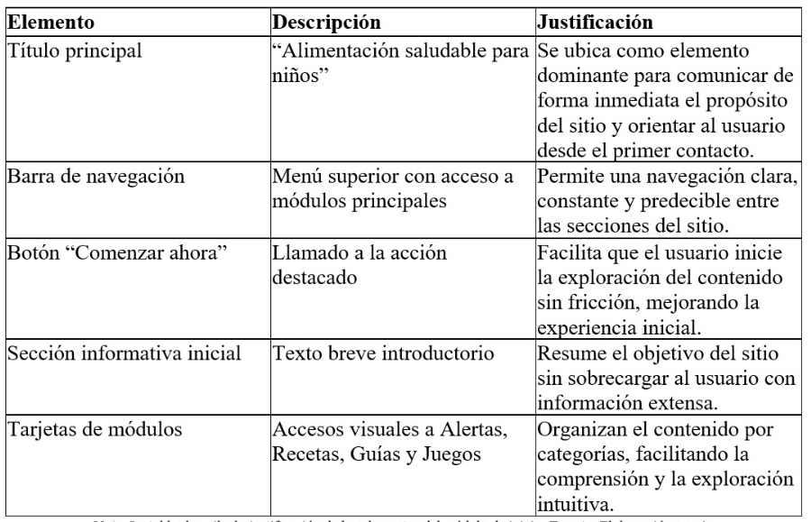
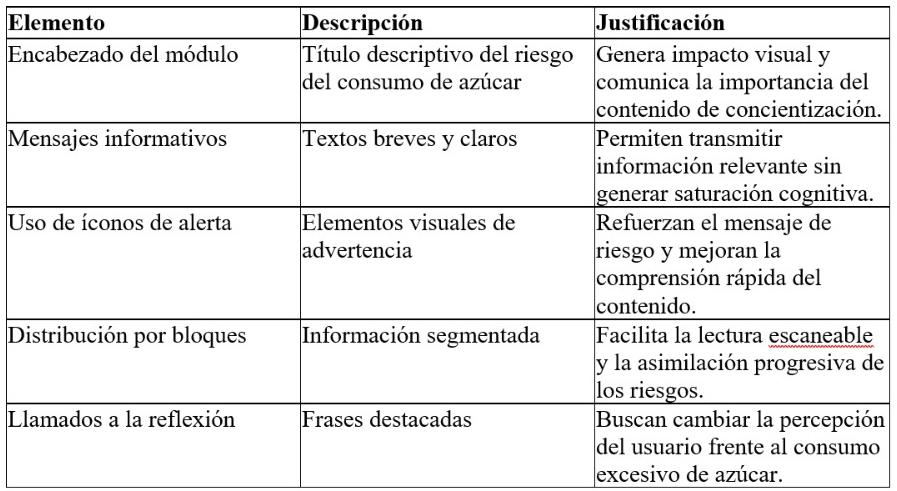
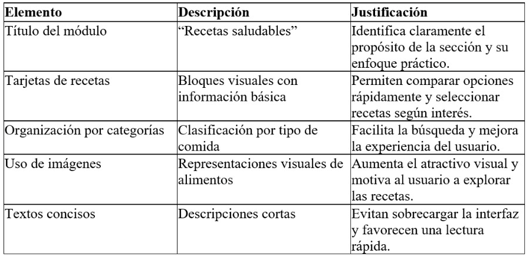
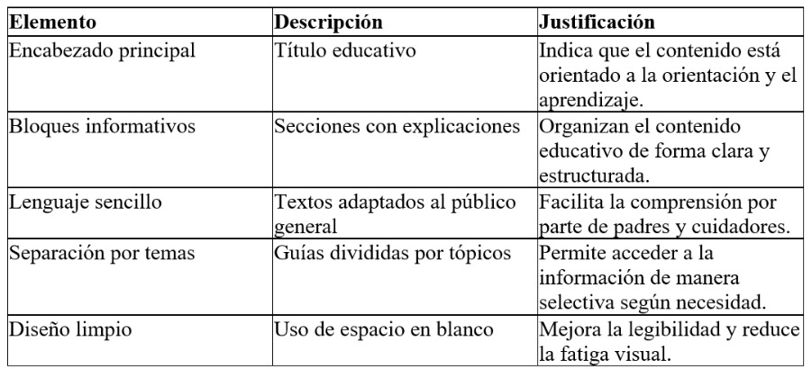
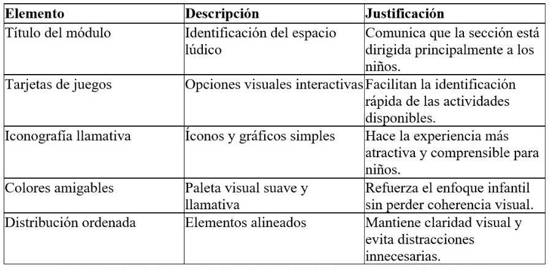
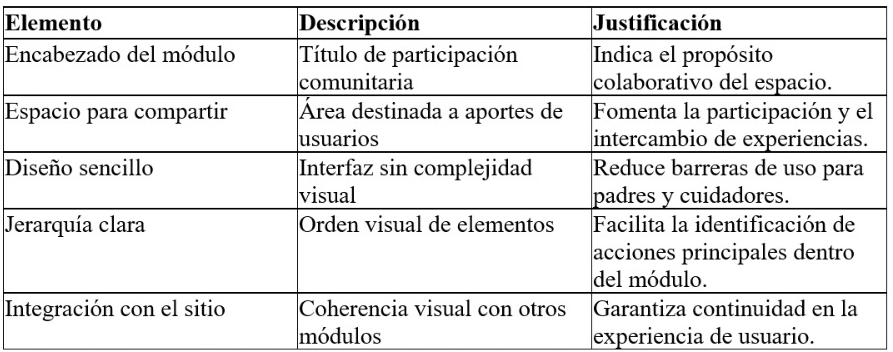

## Justificación por modulo

Tabla 9 - Modulo Inicio

>_Nota. La tabla describe la justificación de los elementos del módulo de inicio. Fuente: Elaboración propia.

Tabla 10 - Modulo Alertas y Concientización

>_Nota. La tabla describe la justificación de los elementos del módulo de inicio. Fuente: Elaboración propia.

Tabla 11 - Modulo Recetas Saludables

>_Nota. La tabla describe la justificación de los elementos del módulo de Recetas saludables. Fuente: Elaboración propia.

Tabla 12 - Modulo Guías de Educación

>_Nota. La tabla describe la justificación de los elementos del módulo de Guías de educación. Fuente: Elaboración propia.

Tabla 13 - Modulo Juegos

>_Nota. La tabla describe la justificación de los elementos del módulo de Juegos. Fuente: Elaboración propia. 

Tabla 14 - Modulo Interacción Comunitaria

>_Nota. La tabla describe la justificación de los elementos del módulo de Interacción Comunitaria. Fuente: Elaboración propia. 

## Jerarquía Visual del sitio web
La jerarquía visual de la web fue definida estratégicamente para guiar la atención del usuario de manera progresiva, asegurando comprensión inmediata del contenido y una navegación intuitiva. Esta jerarquía se construyó a partir del uso consciente de tamaño, color, posición, contraste y agrupación visual, permitiendo diferenciar claramente los niveles de importancia de la información.

## Nivel 1 Elementos primarios (máxima prioridad visual)
En el primer nivel se encuentran los títulos principales de cada página, los cuales presentan un mayor tamaño tipográfico, peso visual alto y una ubicación privilegiada en la parte superior de la interfaz. Estos elementos cumplen la función de comunicar de forma inmediata el propósito de cada módulo (Inicio, Alertas, Recetas, Guías, Juegos), permitiendo que el usuario identifique rápidamente en qué sección del sitio se encuentra. 
Asimismo, los botones de acción principal como “Comenzar ahora” o “Explorar contenido” fueron diseñados con colores contrastantes y formas destacadas para incentivar la interacción y orientar al usuario hacia las acciones más relevantes dentro del sitio.

## Nivel 2 Elementos secundarios (contenido informativo estructural)
El segundo nivel está compuesto por subtítulos, tarjetas de contenido y bloques informativos, los cuales organizan la información principal en secciones claramente delimitadas. Estos elementos poseen un tamaño tipográfico intermedio y se apoyan en el uso de tarjetas visuales para agrupar información relacionada, facilitando la lectura escaneable y reduciendo la carga cognitiva del usuario. 
En este nivel se incluyen las categorías de recetas, los bloques educativos, las secciones de alerta y los módulos lúdicos, los cuales permiten al usuario profundizar en el contenido sin perder el contexto general del sitio.

## Nivel 3 Elementos terciarios (información de apoyo)
El tercer nivel corresponde a los textos descriptivos, etiquetas, iconografía complementaria y elementos visuales secundarios. Estos componentes presentan un tamaño menor y un peso visual más ligero, cumpliendo una función de apoyo informativo sin competir con los elementos de mayor jerarquía. 
La iconografía fue utilizada como refuerzo visual para mejorar la comprensión del contenido, especialmente en módulos dirigidos a niños, permitiendo una interpretación rápida incluso sin una lectura profunda del texto.

## Decisiones de espacio, columnas, grillas y márgenes
El diseño de la web se desarrolló a partir de una estructura visual organizada que prioriza la claridad, la legibilidad y la coherencia entre las distintas pantallas del sitio web. Para lograrlo, se tomaron decisiones conscientes respecto al uso del espacio en blanco, columnas, grillas y márgenes, entendidos como elementos fundamentales para una correcta experiencia de usuario.

## Uso del espacio en blanco
El espacio en blanco fue utilizado de manera estratégica para separar bloques de contenido, evitar la saturación visual y facilitar la comprensión de la información. La presencia de espacios amplios entre secciones permite que el usuario identifique con claridad los distintos módulos del sitio y enfoque su atención en los elementos relevantes sin distracciones innecesarias. Este uso del espacio contribuye a una lectura más cómoda, reduce la carga cognitiva y mejora la percepción general de orden y limpieza visual.

## Sistema de grillas
El prototipo se estructuró mediante una grilla modular, la cual permite mantener alineación y consistencia visual en todas las pantallas. Esta grilla organiza el contenido en bloques bien definidos, garantizando que títulos, textos, tarjetas y botones conserven una disposición coherente entre sí. El uso de la grilla facilita la escalabilidad del diseño y asegura que la interfaz mantenga su estructura tanto en resoluciones de escritorio como en dispositivos móviles.

## Distribución en columnas
La información fue distribuida en columnas para organizar el contenido de forma jerárquica y equilibrada. En vistas principales se emplean columnas que permiten mostrar múltiples bloques de información sin generar sobrecarga visual, mientras que en secciones con mayor carga textual se prioriza una disposición en una sola columna para favorecer la lectura continua. Esta decisión mejora la comprensión del contenido y respeta los patrones naturales de lectura del usuario.

## Definición de márgenes
Los márgenes externos e internos fueron definidos de manera uniforme en todo el prototipo con el fin de delimitar claramente los límites del contenido. Los márgenes laterales evitan que la información se perciba comprimida, especialmente en pantallas pequeñas, mientras que los márgenes verticales separan visualmente secciones distintas. Esta consistencia en los márgenes refuerza la armonía visual del diseño y contribuye a una experiencia de navegación más fluida.

## Factores de accesibilidad (WCAG 2.1)
El diseño del prototipo incorporó principios de accesibilidad basados en las Web Content Accessibility Guidelines (WCAG) 2.1, con el objetivo de garantizar que el sitio web pueda ser utilizado por la mayor cantidad posible de usuarios, incluyendo personas con limitaciones visuales, cognitivas o motrices, así como usuarios que acceden desde dispositivos móviles o con condiciones tecnológicas variables.
Las decisiones de accesibilidad se alinean con los cuatro principios fundamentales de las WCAG 2.1: Perceptible, Operable, Comprensible y Robusto.

## 1.Principio de Perceptibilidad
Para asegurar que la información sea perceptible por todos los usuarios, se tomaron las siguientes decisiones de diseño:
## Contraste de color adecuado: 
Se utilizaron combinaciones de colores que permiten una clara diferenciación entre texto y fondo, facilitando la lectura para personas con baja visión o dificultades visuales.
## Jerarquía tipográfica clara: 
Los títulos, subtítulos y textos descriptivos cuentan con tamaños y pesos diferenciados, permitiendo identificar fácilmente la estructura del contenido.
## Uso de iconografía de apoyo: 
Los íconos complementan el texto y refuerzan el significado de las acciones y secciones, ayudando a usuarios con dificultades de lectura o comprensión. 
Estas decisiones favorecen el cumplimiento de los criterios de éxito relacionados con el contraste y la presentación visual del contenido.

## 2.Principio de Operabilidad
El prototipo fue diseñado para que la navegación y la interacción sean sencillas y accesibles:
## Navegación clara y consistente: 
El menú principal mantiene la misma ubicación y estructura en todas las pantallas, permitiendo que el usuario se desplace por el sitio sin confusión.
## Elementos interactivos claramente identificables: 
Botones y enlaces presentan estilos visuales diferenciados que indican su carácter interactivo.
## Flujo de navegación lógico: 
La disposición de los elementos sigue un orden natural de lectura (de arriba hacia abajo y de izquierda a derecha), facilitando el uso con teclado o tecnologías asistidas. 
Estas prácticas reducen la posibilidad de errores de interacción y mejoran la experiencia de usuarios con limitaciones motrices.

## 3.Principio de Comprensibilidad
Para garantizar que el contenido sea fácil de entender, se aplicaron las siguientes estrategias:
## Lenguaje claro y sencillo: 
Los textos informativos fueron redactados con vocabulario accesible, evitando tecnicismos innecesarios, especialmente en contenidos dirigidos a padres y cuidadores.
## Consistencia visual y funcional: 
Los elementos mantienen un comportamiento predecible a lo largo del sitio, lo que facilita el aprendizaje y uso continuo del sistema.
## Organización lógica del contenido: 
La información se presenta en bloques bien definidos, permitiendo una lectura progresiva y evitando la sobrecarga cognitiva.
Estas decisiones mejoran la comprensión del contenido por parte de usuarios con distintos niveles educativos o cognitivos.

## 4.Principio de Robustez
Aunque el prototipo fue desarrollado inicialmente en herramientas de diseño visual como Figma, se tuvo en cuenta la futura implementación técnica del sistema:
## Estructura semántica clara: 
La organización del contenido permite una futura traducción a código HTML semántico, compatible con lectores de pantalla.
## Compatibilidad con tecnologías asistidas: 
El orden lógico de los elementos facilita la interpretación por herramientas como lectores de pantalla.
## Adaptabilidad a dispositivos móviles: 
El diseño responde correctamente a diferentes tamaños de pantalla, garantizando una experiencia accesible en entornos móviles.
