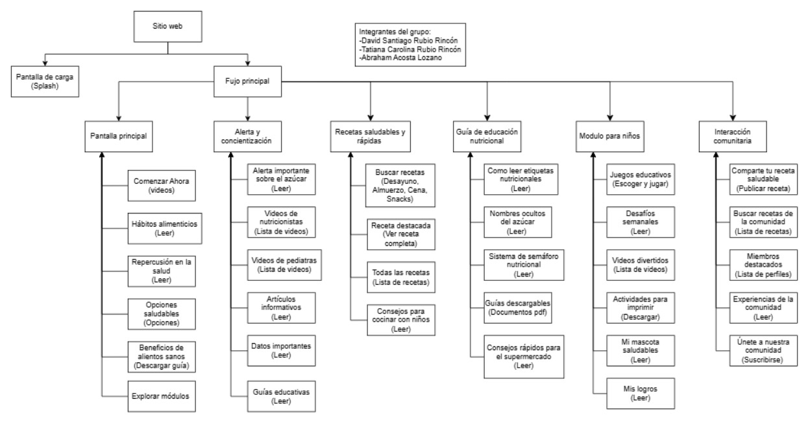

# Diagrama de SiteMap

En este diagrama de SiteMap se describe la estructura principal de todos los módulos y páginas del sitio web desarrollado, con todas sus posibles rutas de navegación que el usuario puede tomar dentro del sitio, además de una pequeña descripción en cada opción que muestra el tipo de documento que posee.

Enlace Site Map
https://drive.google.com/file/d/1Xe7MMMNsQKVNHopy4e6ml5FoaEqMfNJD/view?usp=sharing 

> _Nota. SiteMap de estructura principal de los módulos del sitio web. Fuente: Elaboración propia en draw.io._