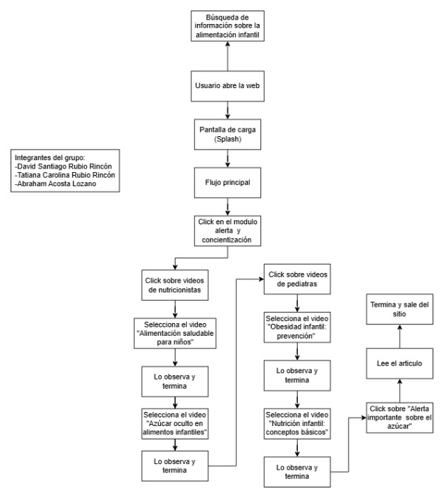

# Diagrama de UserFlow

En este diagrama de UserFlow se observa la ruta que un usuario toma paso a paso para realizar la búsqueda de información sobre la alimentación infantil en el sitio web, junto a la acción que desarrolla en cada movimiento.

Enlace UserFlow
https://drive.google.com/file/d/1joGG8-T8JGcdN3ipYrBfnkNkpgbay4Em/view?usp=sharing 

> _Nota. UserFlow de la ruta que un usuario toma paso a paso para realizar la búsqueda de información sobre la alimentación infantil. Fuente: Elaboración propia en draw.io._